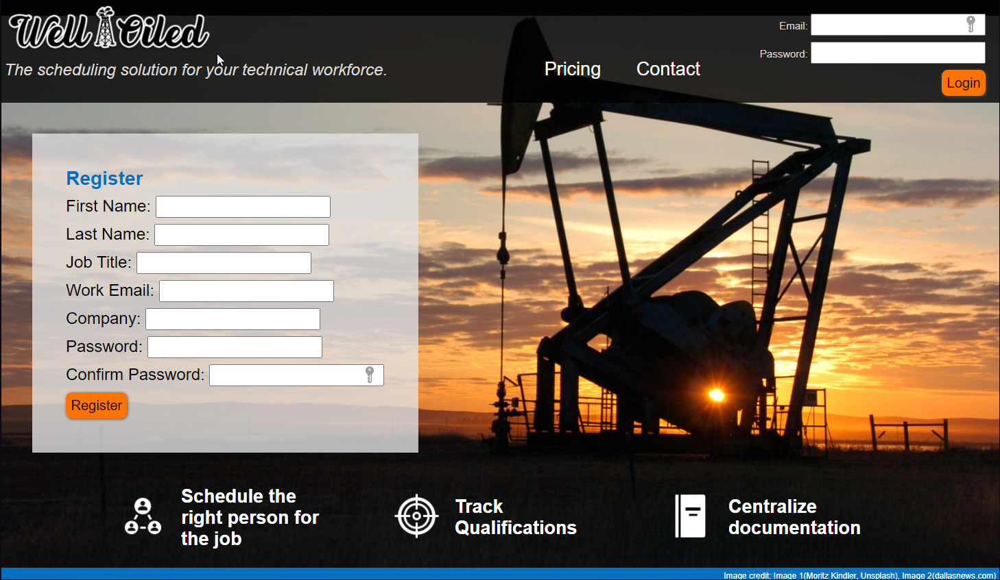
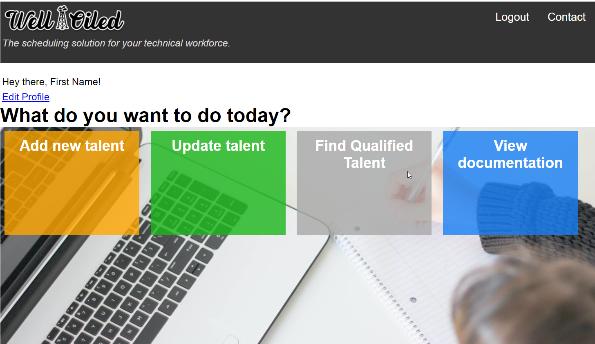
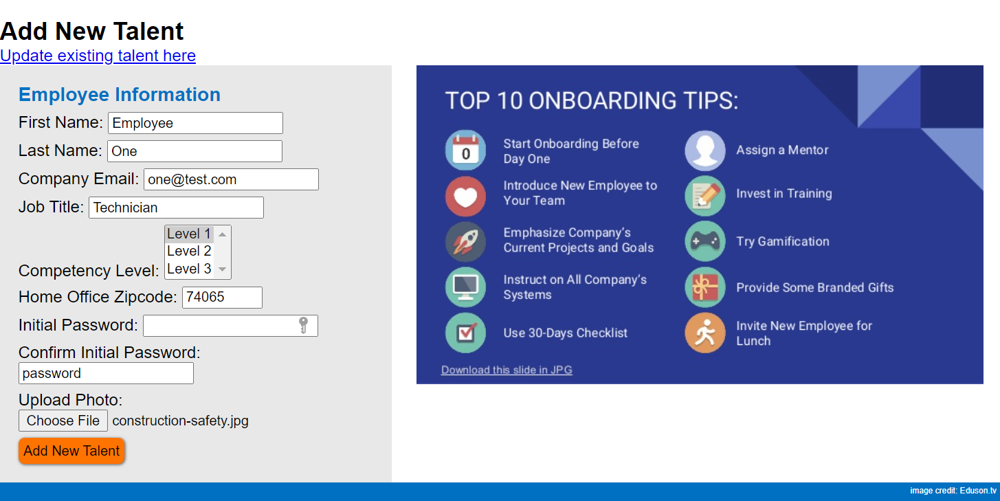
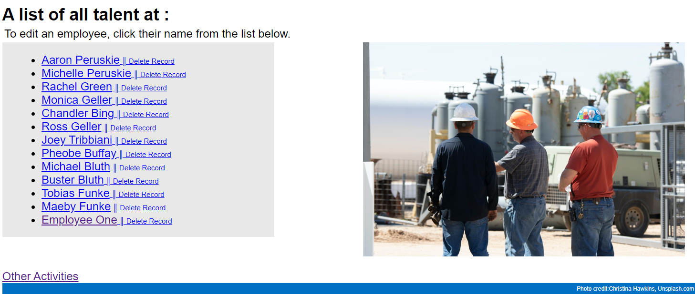
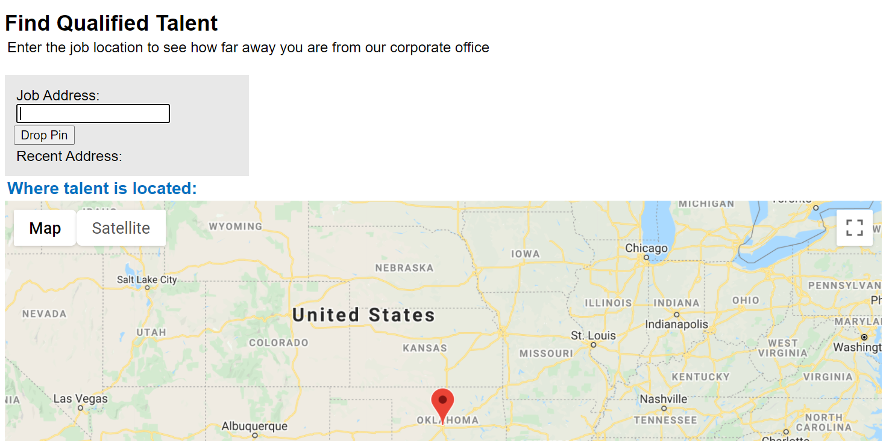
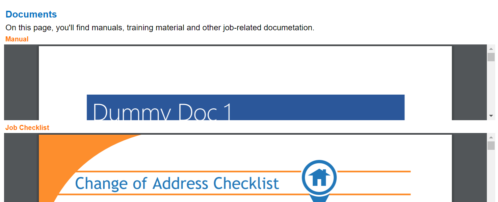

# Well-Oiled
 
Deployment-ready talent planning and tracking system built with a Python framework that allows organizations to add and track technical employees, view related job aids, and utilize a Google Maps API.

# Short Video Overview

# Instructions
## Login & Registration
1. Enter your information to register a new profile or log in if you already have a profile. 

## Activities
1. Edit your profile directly under your greeting. 
2. You may choose one of four options: add new talent, update existing talent, find qualified talent for the job at hand, or view documentation.

### Add New Talent
1. Enter the talent's basic company information.
2. Select the level of the talent's competency.
3. Set a basic password that your talent can later update once they log in for themselves. 
4. Upload an appropriate photo of the talent.
5. Click Add New Talent to add them to the database. 

#### Page Goals
Eventually, I would like to add an admin function that allows for creating customized levels and other information to suit an individual company's needs. 

### Update Talent
1. Choose the talent that you would like to update by clicking their name on the list. 
   a. You may optionally choose to delete a name from the Update Talent screen. 
2. Once a name is chosen, you may update any information desired on the talent's profile. 

WARNING: Deleted names cannot be recovered. It must be re-added. 

### Find Qualified Talent
1. Enter an address into the address bar to display a pin on the map. 

This page is still under construction. As it stands, it demonstrates my ability to implement the Google Maps API using Javascript. 

#### Page Goals
Eventually, I would like for it to function as a scheduling page. If one enters a job address, pins will drop to show the nearest qualified talent for the job. Once a technician is scheduled, it will optionally populate a screen of only relevant documentation to the job scheduled based on the user's parameters. 

### View Documentation
1. View embedded documentation by scrolling within each section. 

This page is still under construction. However, the idea is that your talent will be able to pull up relevant documentation to the job for which they are scheduled. 

#### Page Goals
I'd like for them to be able to click on the preview and then pull up a full version of the document with the option to either send it to their device of choice or print it out. In time, it may function as a full documentation library for companies.

 
